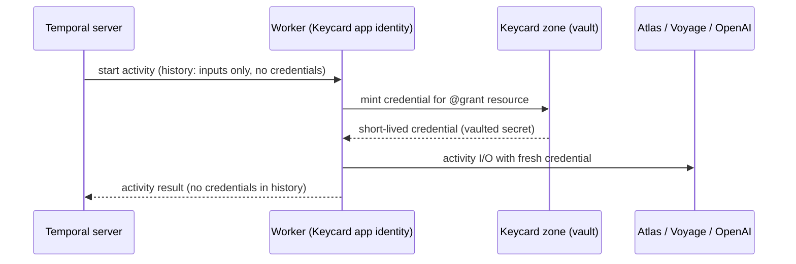
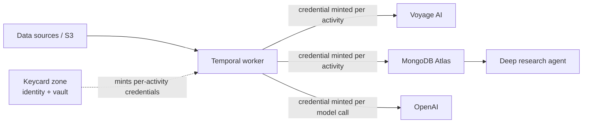

# MongoDB × Temporal — Partner Reference Architecture

A production-grade reference implementation that shows how **Temporal** and **MongoDB Atlas** work
together to build a durable, change-driven RAG pipeline with a deep-agent chat interface.

> **Developers:** see [docs/RUNBOOK.md](docs/RUNBOOK.md) for prerequisites, API key setup,
> local spin-up, and cloud infra references.

---

## What is Temporal?

[Temporal](https://temporal.io) is a **durable execution platform**. It orchestrates long-running
workflows as code — with automatic retries, checkpointing, and resume-on-failure built in. You
write plain Python functions; Temporal ensures they run to completion even across crashes, deploys,
or network partitions.

In this architecture Temporal owns two critical concerns:

| Concern            | What Temporal guarantees                                                                                                                                                                          |
| ------------------ | ------------------------------------------------------------------------------------------------------------------------------------------------------------------------------------------------- |
| Ingestion pipeline | A crash mid-embedding resumes from the last completed chunk — never re-embeds what is already done ([durable execution](https://docs.temporal.io/evaluate/major-advantages#fault-oblivious-code)) |
| Agent workflows    | Multi-step agent plans are durable; a failure mid-conversation resumes without losing tool results or memory writes ([workflows as code](https://docs.temporal.io/workflows))                     |

---

## The problem this solves

Customers hand-roll resilient ingestion/embedding pipelines and it hurts:

| Customer   | Pain hand-rolled without Temporal                                        |
| ---------- | ------------------------------------------------------------------------ |
| Customer A | MD5 change-tracking in production to decide what to re-embed             |
| Customer B | A homegrown "lambda clock" cron to generate embeddings                   |
| Customer C | A FastAPI pipeline, hand-tuning sequential vs. parallel                  |
| Customer D | A 5-hour import that fails on the last step **reruns the entire import** |

This PRA packages the pattern that removes that pain — already in production at multiple enterprise customers.

---

## Partner Solutions Architecture

### High-level design


Temporal is used to bring durability to both the content ingestion pipeline and to the agent that leverages the ingested content.

**How to read it:**

1. Changes in **Data Soruces** (S3, RDBMS, messaging technologies, etc.) directly
   launch workflows running in Temporal
2. **Temporal** chunks the content, calls **Voyage AI** for embeddings, and upserts into
   **Atlas Search**.
3. A **durable research agent** (OpenAI Agents SDK, running as a Temporal workflow) answers
   questions over the fresh knowledge, using vector search + rerank (and web search) as tools.

> **Design note:** the direct trigger (i.e. S3 to the Ingestion Workflow) leverages
> Temporal's durable execution to provide the "don't lose the event once the workflow starts"
> guarantee. For those who already have a change data capability wired through Kafka, please see [this](https://github.com/mongodb-partners/mdb-temporal-pra/tree/with-kafka) branch.

### Division of responsibility

| Concern                                                       | Owner                   |
| ------------------------------------------------------------- | ----------------------- |
| Orchestration, retries, checkpointing, backfill, resumability | **Temporal**            |
| Operational data, vector index, agent memory & state          | **MongoDB Atlas**       |
| Embeddings & reranking                                        | **MongoDB Voyage AI**   |
| Agent reasoning & answers                                     | **OpenAI (Agents SDK)** |
| Worker identity, just-in-time credentials, credential audit   | **Keycard**             |

---

## System architecture


### Atlas data model

```text
Database: temporal
├── chunks_staging       ← intermediate chunks during IngestWorkflow
├── knowledge            ← embedded docs + Atlas Vector Search index (active)
├── knowledge_v2         ← BackfillWorkflow writes here on model upgrade (blue/green)
├── temporal_config      ← active collection/index pointer (flipped by cutover)
└── agent_memory         ← reserved for agent memory (not yet written)
```

Retrieval and (future) agent memory live in the **same database** — no second copy, and no sync
lag between what the pipeline writes and what the agent reads.

---

## Ingestion

Ingestion turns objects landing in storage into embedded, searchable knowledge — durably, and
**without a message broker**. An S3 **ObjectCreated** event starts a Temporal `IngestWorkflow`
directly (an AWS Lambda in production, a MinIO webhook locally — both through the shared
`handle_s3_event`). The moment `start_workflow` returns, the change is safe: Temporal runs the
workflow to completion across retries, worker restarts, and infra maintenance.

- **Trigger goes directly to Temporal** Temporal's durable execution provides the "don't lose the
  event" guarantee; the trigger is a thin adapter (`pipeline/lambda_handler.py` /
  `POST /ingest-event`).
- **Idempotent, update-in-place.** A content-hash check skips re-embedding unchanged objects; an
  edited object re-embeds and upserts in place (see the two-hashes note below).
- **Parallel & scale-out.** Chunks embed in parallel waves; add worker processes on the same task
  queue to scale horizontally.
- **Output.** Embedded chunks land in `knowledge` with an Atlas Vector Search index, ready for the
  agent. Internals: `docs/LLD.md` §5–6.

### Ingestion sequence diagram


---

## The agent

The agent answers questions over the ingested knowledge as a **durable Temporal workflow**
(`DeepResearchAgent`), built with the **OpenAI Agents SDK**. Instead of a fixed
retrieve → rerank → answer chain, the model is handed the retrieval pipeline as **tools** and
decides which to call, and how often.

- **Tools.** `vector_search` and `rerank` are Temporal activities over Atlas + Voyage, plus a
  hosted **web search** to supplement the corpus.
- **Durable & auditable.** The reasoning loop _is_ a workflow, so every model and tool call is a
  history event — resumable after a crash and fully inspectable in the Temporal UI.
- **Live progress.** Run hooks record human-readable steps; the UI starts the run
  (`POST /research`) and polls a workflow `query` (`GET /research/{id}`) to show the trace as it
  unfolds (step-level, not token streaming).
- **Opt-in.** Loads only when `OPENAI_API_KEY` is set — ingestion runs without it. Full design:
  `docs/agent-retrieval.md`.

### Sequence — research query


---

## Keycard: runtime credentials for the pipeline and agent

[Keycard](https://keycard.ai) gives the worker its own identity and replaces the
three static secrets in `.env` (`MONGODB_URI`, `VOYAGE_API_KEY`,
`OPENAI_API_KEY`) with credentials minted just in time. The secrets live in a
Keycard zone's vault; the worker authenticates as an application and mints what
each activity needs, when it needs it.

How it composes with Temporal:

- The worker registers Keycard's `KeycardInterceptor`
  ([`keycardai-temporal`](https://pypi.org/project/keycardai-temporal/)) once,
  in `pipeline/worker.py`.
- Every activity declares its resource with `@grant(...)`. When Temporal starts
  the activity, the interceptor mints a fresh credential for that execution and
  `access()` returns it inside the activity. The MongoDB Atlas connection
  string is minted this way, per activity execution.
- The Voyage key is minted per activity execution too: the embed, rerank, and
  vector-search activities declare both resources in one `@grant`. The OpenAI
  key mints per model call through `KeycardOpenAIProvider`
  (`keycardai-temporal[openai-agents]`): the agents plugin builds its client
  before any activity runs, so the provider hands that client an async key
  callback that mints from the vault and refreshes on a short window.
- Nothing credential-shaped enters workflow history. Temporal persists and
  replays history indefinitely, which is exactly where a static token does the
  most damage.



The payoff, and the demo to try: start a research query, kill the worker
mid-flight, rotate the vaulted Atlas secret in Keycard, and restart the worker.
The workflow resumes and completes, because recovery re-runs the activity and
the activity mints fresh. Revoking a credential no longer strands in-flight
work, and the zone's audit log shows every mint attributed to the worker's
identity.

### The last secret, and how it disappears

In this local demo the worker authenticates to Keycard with a client secret
(`KEYCARD_CLIENT_ID` / `KEYCARD_CLIENT_SECRET`), because on a laptop no
platform vouches for the workload. That trades three static secrets for one,
and the one exists only because of localhost.

Deployed to a platform that issues workload identity, the last secret goes
away with no code changes: the SDK's credential discovery prefers a workload
identity token file over everything else, reading the conventions for EKS
(IRSA's `AWS_WEB_IDENTITY_TOKEN_FILE`), AWS container credentials, Azure
federated tokens, and SPIRE JWT-SVIDs written to a file. The worker then
starts with an empty secret environment: its identity comes from the platform,
and everything else mints per activity.

Vaulting and federation are different strengths of "disappears". A vaulted
secret leaves `.env` but still exists: a long-lived key in the zone's vault,
delivered just in time, rotated by hand. Federation removes the secret
entirely: the workload presents a short-lived identity token, the far side
verifies it against a registered issuer, and a minutes-lived access token
comes back, so there is nothing to store, rotate, or leak. OpenAI now
supports exactly this (workload identity federation for API access), which
opens two upgrades for the vaulted OpenAI key here: exchange the worker's
platform identity with OpenAI directly, or register the Keycard zone itself
as the OIDC issuer, so the same per-activity Keycard token an activity
already mints becomes the input OpenAI exchanges. The second keeps Keycard
as the authorization and audit point for every model call. The vault then
remains only for services that cannot verify identity, which today means
Voyage and the Atlas connection string. One related note for Temporal Cloud:
the namespace API key (or mTLS key) a worker uses to reach Temporal Cloud is
itself a static secret, and it vaults in Keycard the same way.

Enable Keycard mode (optional; without it the repo runs from `.env` exactly as
before). The full walkthrough, including the kill-and-rotate demo script, is in
[docs/keycard-demo-runbook.md](docs/keycard-demo-runbook.md):

```bash
# one-time zone setup: application, vault-backed resources, dependencies
MONGODB_URI='mongodb+srv://...' VOYAGE_API_KEY='...' OPENAI_API_KEY='...' \
  uv run python -m infra.provision_keycard
# writes KEYCARD_* into .env; the three secrets above never land in .env
```

### Where Keycard sits in the high-level design

For the architecture diagrams above, Keycard adds one box and annotates three
existing edges; nothing else in the picture moves:



- New box: **Keycard zone (identity + vault)**, attached to the Temporal
  worker. The worker authenticates to it as an application; the three upstream
  secrets live in its vault.
- Annotated edges: **worker → Atlas** and **worker → Voyage** carry credentials
  minted per activity execution (one `@grant` declares both); **worker →
  OpenAI** carries keys minted per model call through the Keycard model
  provider. No static keys ride any of these edges, and none appear in
  workflow history.

---

## Quickstart (local demo)

**Prerequisites:** `uv`, Docker, Temporal CLI, and Node 20+ — see [docs/RUNBOOK.md → Prerequisites](docs/RUNBOOK.md#prerequisites) for install commands.

```bash
# 1. Clone and enter the repo
git clone https://github.com/mongodb-partners/mdb-temporal-pra.git
cd mdb-temporal-pra

# 2. Copy and fill in credentials
cp .env.example .env
# Edit .env: set MONGODB_URI, VOYAGE_API_KEY, OPENAI_API_KEY
# (or vault them in Keycard instead and leave all three empty; see the
#  Keycard section above; infra/provision_keycard.py does the zone setup)

# 3. Install all dependencies (Python + UI)
make setup

# 4. Start everything (MinIO, Temporal, worker, trigger API, agent API + UI)
make start

# 5. Create the Atlas Vector Search index (one-time)
make index

# 6. Seed a sample document to trigger the full pipeline
make seed

# 7. Open the agent UI
open http://localhost:5173

# 8. Tear everything down
make stop
```

`make help` lists all available targets.

| Service         | URL                   | Login                                           |
| --------------- | --------------------- | ----------------------------------------------- |
| Agent chat UI   | http://localhost:5173 |                                                 |
| Temporal Web UI | http://localhost:8233 |                                                 |
| Agent API       | http://localhost:8090 |                                                 |
| MinIO console   | http://localhost:9001 | username: `minioadmin`, password: `minioadmin`  |
| Trigger API     | http://localhost:8088 | webhook `/ingest-event` (default local trigger) |

---

## Repo layout

```text
mdb-temporal-pra/
├── README.md
├── Makefile                        ← all dev commands (make help)
├── pyproject.toml                  ← Python deps managed by uv
├── .env.example                    ← copy → .env, fill credentials
├── tests/                          ← pytest (uv run pytest) — handler + parser tests
├── agent/
│   ├── api.py                      ← FastAPI: /research start + poll (:8090)
│   ├── agent_workflow.py           ← DeepResearchAgent (OpenAI Agents SDK loop as workflow)
│   ├── tools.py                    ← agent tools: vector_search, rerank (as activities)
│   └── ui/                         ← React/Vite chat UI (:5173)
├── pipeline/
│   ├── worker.py                   ← Temporal worker process
│   ├── trigger.py                  ← shared handle_s3_event → start IngestWorkflow
│   ├── trigger_api.py              ← webhook /ingest-event + manual /ingest-trigger
│   ├── lambda_handler.py           ← AWS Lambda entrypoint for real S3 (same handler)
│   ├── workflows/
│   │   ├── ingest_workflow.py      ← IngestWorkflow: fetch → chunk → embed → index
│   │   └── backfill_workflow.py    ← BackfillWorkflow: re-embed → knowledge_v2
│   ├── activities/
│   │   ├── ingest.py               ← fetch + stage + embed + index activities
│   │   └── backfill.py             ← re-embed activity
│   ├── extractors/                 ← md / pdf / csv / text extractors
│   ├── config_store.py             ← active collection/index pointer
│   └── search_index.py             ← idempotent Atlas Vector Search management
└── infra/
    ├── docker-compose.yml          ← MinIO (S3 events → webhook /ingest-event)
    └── atlas_indexes.json          ← Vector Search index definitions
```

---

## Developer guide

| Document                                               | Description                                                                                       |
| ------------------------------------------------------ | ------------------------------------------------------------------------------------------------- |
| **[docs/RUNBOOK.md](docs/RUNBOOK.md)**                 | Prerequisites, API key setup, local spin-up, cloud infra references                               |
| **[docs/LLD.md](docs/LLD.md)**                         | Low-level design — data contracts, workflow internals, scaling to multiple sources and data types |
| **[docs/agent-retrieval.md](docs/agent-retrieval.md)** | The deep agent — retrieval, rerank, synthesis, and how it ties to the vector store                |
| **[docs/decisions/](docs/decisions/)**                 | Architecture Decision Records — e.g. ADR 0001 (direct-from-S3 triggering)                         |
